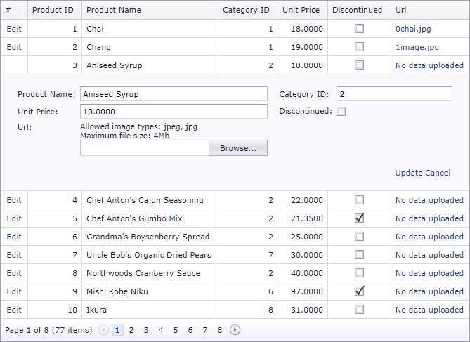

<!-- default badges list -->

[](https://supportcenter.devexpress.com/ticket/details/E4644)
[](https://docs.devexpress.com/GeneralInformation/403183)
<!-- default badges end -->

# GridView for Web Forms - How to upload files in Edit mode and see them on a click in Browse mode

This example demonstrates how to upload image files from the Grid View edit form and display the uploaded images. 



## Implementation Details

The Grid View in this example contains an [unbound column](https://docs.devexpress.com/AspNet/3732/components/grid-view/concepts/data-representation-basics/columns/unbound-columns) populated with [ASPxHyperLink](https://docs.devexpress.com/AspNet/DevExpress.Web.ASPxHyperLink) controls. When a data row has no image, the link has no target and displays the `"No data uploaded"` text.

```aspx
 <dx:GridViewDataTextColumn FieldName="Url" UnboundType="Object" VisibleIndex="6">
  <DataItemTemplate>
    <dx:ASPxHyperLink ID="ASPxHyperLink" OnLoad="ASPxHyperLink_Load" runat="server" Target="_blank" Text="No data uploaded">
    </dx:ASPxHyperLink>
  </DataItemTemplate>
  <%--...--%>
</dx:GridViewDataTextColumn>
```

The link column's [EditItemTemplate](https://docs.devexpress.com/AspNet/DevExpress.Web.GridViewDataColumn.EditItemTemplate) contains an [ASPxUploadControl](https://docs.devexpress.com/AspNet/DevExpress.Web.ASPxUploadControl), which allows users to upload files in edit mode. 

```aspx
 <dx:GridViewDataTextColumn FieldName="Url" UnboundType="Object" VisibleIndex="6">
  <%--...--%>
  <EditItemTemplate>
    <dx:ASPxUploadControl ID="ASPxUploadControl1" ShowProgressPanel="true" UploadMode="Auto" AutoStartUpload="true" FileUploadMode="OnPageLoad"
        OnFileUploadComplete="ASPxUploadControl1_FileUploadComplete" runat="server">
        <ValidationSettings MaxFileSize="4194304" MaxFileSizeErrorText="Size of the uploaded file exceeds maximum file size" AllowedFileExtensions=".jpg,.jpeg">
        </ValidationSettings>
        <ClientSideEvents FileUploadComplete="OnFileUploadComplete" />
    </dx:ASPxUploadControl>
    <%--...--%>
</EditItemTemplate>
</dx:GridViewDataTextColumn>
```

## Files to Look At
<!-- default file list -->
- [Default.aspx](./CS/Default.aspx) (VB: [Default.aspx](./VB/Default.aspx))
- [Default.aspx.cs](./CS/Default.aspx.cs) (VB: [Default.aspx.vb](./VB/Default.aspx.vb))
<!-- default file list end -->

## Documentation

- [ASPxGridView](https://docs.devexpress.com/AspNet/DevExpress.Web.ASPxGridView)
- [Unbound Columns](https://docs.devexpress.com/AspNet/3732/components/grid-view/concepts/data-representation-basics/columns/unbound-columns)

## More Examples

- [GridView for Web Forms - How to upload files in Edit mode and save them in a binary column](https://github.com/DevExpress-Examples/aspxgridview-how-to-upload-files-in-edit-mode-and-save-them-in-a-binary-column-t285123)
